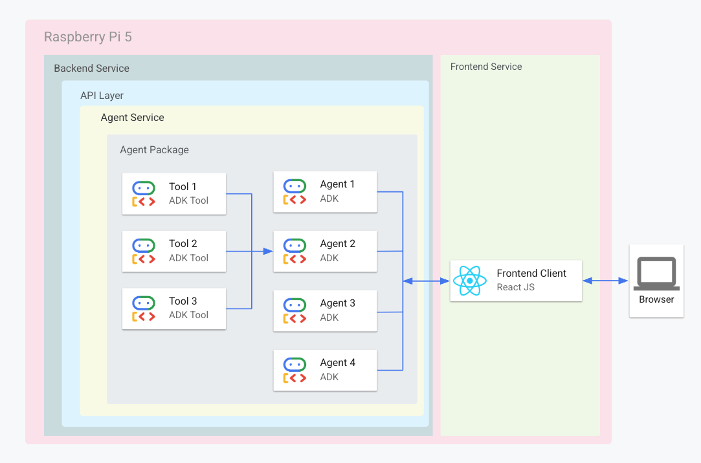

<div align="center">
  

  <br>
</div>

---

# Collective Bargaining Agreement & Grievance Agent


[](https://opensource.org/licenses/Apache-2.0)

Created by [Loïc Muhirwa](https://github.com/justmeloic)

An agentic question answering system powered by AI for CBA analysis,
built with Google Cloud Platform services.

## Services

Each service has its own README with specific setup instructions. Please refer to:

- [Frontend Setup](services/frontend/README.md)
- [Agent Orchestration Setup](services/agent-orchestration/README.md)

### Frontend Client (services/front-end)

A Next.js web application that provides the user interface for interacting with the CBA analysis system.

### Agent Orchestration (services/agent-orchestration)

The backend service that coordinates AI agents for:

- Understanding user queries
- CBA analysis
- Response generation

## Repository Structure

```
.
└── services/
    ├── agent-orchestration/      # Backend service for AI agent orchestration
    │   ├── pyproject.toml       # Python project dependencies
    │   ├── src/                 # Source code for agent orchestration
    │   └── uv.lock              # Dependency lock file
    │
    └── front-end/              # Next.js web application
```

## Architecture



## Component Usage

| Component                   | Type             | Description                                                                                 |
| --------------------------- | ---------------- | ------------------------------------------------------------------------------------------- |
| GCS Bucket                  | GCP              | Storage for raw CBA files, temporary processing data, and backup storage                    |
| Cloud Logging               | GCP              | Monitors application performance and tracks data processing operations                      |
| Cloud Run                   | GCP              | Hosts containerized services for web interfaces and APIs                                    |
| ADK (Agent Development Kit) | Development Tool | Provides development tools and libraries for building and testing the agentic orchestration |

## Deployment Models

This project is structured to support two primary deployment models, offering flexibility based on your operational needs, team structure, and scaling requirements. The choice of model can impact local development, testing, and production rollout.

### 1. Independent Services (Microservice-Style)

In this model, the Next.JS frontend and the FastAPI backend are deployed and managed as separate, independent services.

### _Dev_

```bash
cd services/frontend/
npm run dev
```

```bash
cd services/agent-orchestration/src/
uv run app.py
```

**Architecture:**

```mermaid
graph TD
  subgraph Frontend Service
    A1[Next.js App] --> A2[npm run dev]
  end

  subgraph Backend Service
    B1[FastAPI App] --> B2[uv run app.py]
  end

  A1 <-->|"API Calls"| B1
```

### 2. Modular Monolith (Combined Deployment)

In this model, the FastAPI backend serves the static assets generated from the Next.JS frontend, creating a single deployable unit. This is the model facilitated by the npm run build script in the frontend service, which prepares assets for the backend.

### _Dev_

```bash
cd services/frontend/
npm run build-local # This builds the static (pre-rendered into HTML, CSS, and JavaScript files) frontend into "out" and copies it over to the backend agent-orchestration/static_frontend

cd ../agent-orchestration/src/
uv run app.py # Services backend with agent-orchestration/static_frontend mounted
```

**Architecture:**

```mermaid
graph TD
  subgraph Build Process
    C1[Next.js App] --> C2[npm run build]
    C2 --> C3[Static Assets: HTML/CSS/JS]
    C3 --> C4[Copy to Backend static_frontend/]
  end

  subgraph Unified Service
    D1[FastAPI App] --> D2[Serves Static Frontend]
    D1 --> D3[API Endpoints]
    C4 --> D2
  end
```

## Session Management

The following diagram illustrates how session IDs are managed between the frontend and backend:

```mermaid
sequenceDiagram
    participant Client
    participant LocalStorage
    participant Frontend
    participant Backend
    participant SessionService

    %% Initial Request without Session ID
    Client->>Frontend: Start conversation
    Frontend->>LocalStorage: Check for existing sessionId
    alt No existing session
        Frontend->>Backend: POST /api/v1/root_agent (no X-Session-ID header)
        Backend->>SessionService: Create new session
        Backend-->>Frontend: Response with new X-Session-ID header
        Frontend->>LocalStorage: Store sessionId
    else Has existing session
        LocalStorage-->>Frontend: Return stored sessionId
        Frontend->>Backend: POST /api/v1/root_agent (with X-Session-ID header)
        Backend->>SessionService: Validate & use existing session
        Backend-->>Frontend: Response with same X-Session-ID
    end

    %% Subsequent Requests
    Note over Client,SessionService: Subsequent Requests
    Client->>Frontend: Send message
    Frontend->>LocalStorage: Get stored sessionId
    LocalStorage-->>Frontend: Return sessionId
    Frontend->>Backend: POST with X-Session-ID header
    Backend->>SessionService: Get existing session
    SessionService-->>Backend: Return session
    Backend-->>Frontend: Response with same X-Session-ID
```

The session management flow works as follows:

1. **Initial Request**:

   - If no session exists, the frontend makes a request without a session ID
   - The backend generates a new UUID and creates a new session
   - The session ID is returned in the X-Session-ID header
   - The frontend stores this ID in localStorage

2. **Subsequent Requests**:

   - The frontend retrieves the session ID from localStorage
   - All requests include the X-Session-ID header
   - The backend validates and uses the existing session
   - The same session ID is returned in responses

3. **Session State**:
   - The backend maintains session state using ADK's InMemorySessionService
   - Each session tracks conversation history and user context
   - Sessions persist as long as the backend service is running

This stateful approach ensures conversation continuity and context preservation across multiple interactions.

## License

This project is licensed under the Apache License, Version 2.0 - see the [LICENSE](LICENSE) file for details.
